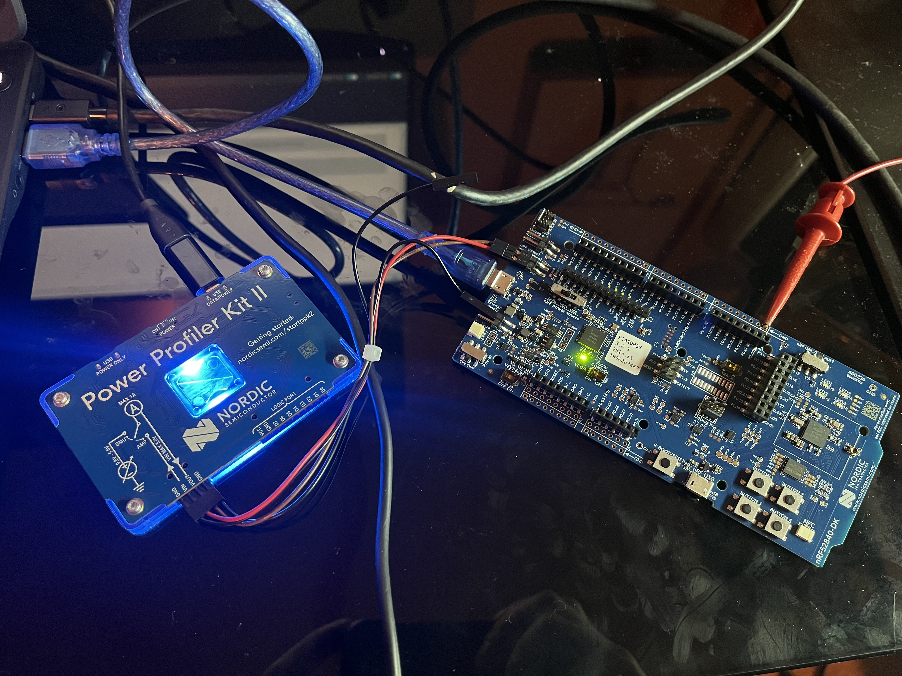
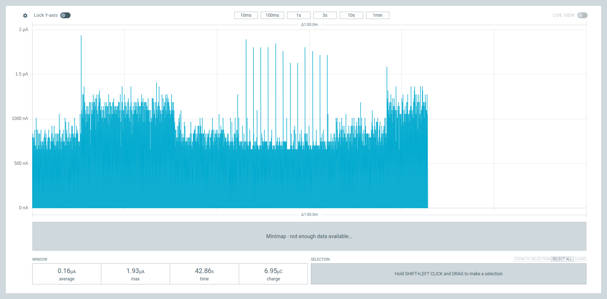
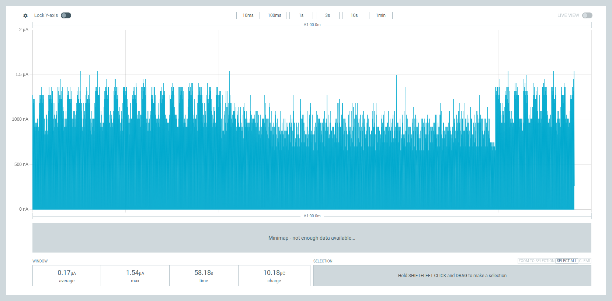

## Week 1 - Development Environment, Tools, Basic GPIO

#### circle_blinky
Simple program for the nRF52840 that makes it's LEDs blink in a rapid clockwise fashion. Demonstrates some basic GPIO. See circle_blinky/src/main.c

#### button_blinky
Anoter simple program, but this one uses the buttons onboard the nRF to switch between different states for the LEDs. One that's just on, one that's just off, one that flashes all the LEDs, and one that flashes them in sequence.

#### Notes on the Power Profiler Kit II (PPK2)
In order to setup the PPK2 I had to download the desktop version of nRF Connect, and get the Power Profiler software from within that program. Once that was installed and running, I selected the connected PPK2, set it to ampere mode, and disabled power output. I originally had power output enabled, but when that was the case it just showed what seemed to be noise around 500 nA, which is not much higher than the minimum amount of current the manual says it can measure.

Above is a picture of the PPK2 attached to the nRF. The VIN and VOUT pins on the PPK2 are connected to the nRF's current measurement pins, and one of the ground pins on the PPK2 is attached to the negative pin on the nRF's external supply pins.

Above is a graph of the amps drawn by the nRF while the button_blinky program was running. It's possible to see when each mode was running within the graph, as it has distinct patterns of power consomption that correspond to each mode. Initially, all the LEDs were on, then they were turned off (which strangely drew a higher current), then the leds were blinking in sequence which drew a similar amount to when all the LEDs were on. The most distinct pattern is when the LEDs were flashing, which produced spikes in the graph.

Above is a graph of the amps drawn by the nRF while one of the sample programs (bluetooth/peripheral_hr) was running. The sections with wider and higher spikes corresponded to when the nRF was disconnected and advertising a BLE signal, and the section in the middle with lower power consumption corresponded to when it was connected to my phone.
