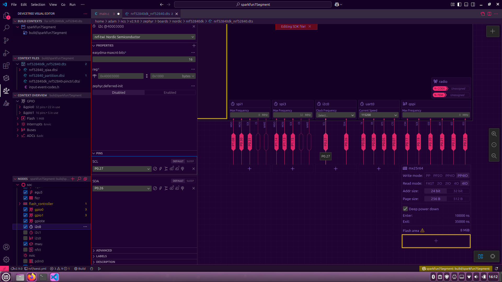

## Week 4 - I2C and VS Code

### VS Code
Before working with I2C, I set up the development environment again on my freshly repaied and reimaged computer. Instead of going with the command line tools, this time I used VS code and Nordic Semiconductor's extensions for VS code. I had previously tried to do that, but got stuck on some error stemming from a problem with git. I was able to get it to work this time, and I recorded the steps I took to do so. See steps.txt.
I would argue that using VS code is better because it makes navigation much much quicker, has autocomplete, and has a wonderful graphical editor for devicetree files. The image below is the editor.

I accidentally edited the SDK file that contained the base devicetree file for the nRF52840 (you can see the warning near the top of the above image which I did not heed) so now i2c0 is mapped to SCL --> P0.03, SDA --> P0.04 instead of P0.27 and P0.26 as pictured.

### sparkfun7Segment
I got an I2C bus working by communicating with the Sparkfun 7 segment display from CSCI5143. The folder contains everything the vs code extensions automatically setup for me. No need to clone the entire zephyr git repo I guess.
The program just writes characters to the display, nothing fancy, but it's final version does use remapped pins for i2c0, which I had to delve into devicetree a little to figure out. As cool as the graphical editor above is, I actually just wrote it in an editor - that way I could add comments. See sparkfun7Segment/nrf52840dk_nrf52840.overlay.
I2C works very similarly to SPI in the C code, you first initialize a device, then you can just write and receive by using the correct commands.

### asyncSerial
I attempted to get the board to read data from the geiger counter's serial output and I think I'm close! One of my previous commits says it works, but I think it was a sort of mirage. I think the data I thought I was getting was actually coming from the micro USB port and that the uart0 node wasn't remapped to the pins I thought I should have been using... But on the bright side I am receiving data through the uart0 bus! I guess that's something I can continue next week.
I also wrote a file to use the on board LEDs for debugging. Pretty clever if you ask me. See asyncSerial/src/ledControl.c.
